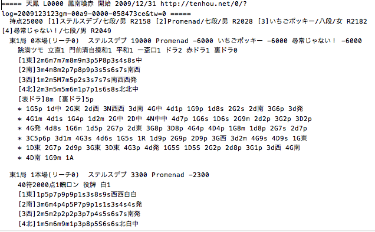

```{r message=FALSE, warning=FALSE, include=FALSE, paged.print=FALSE}
library(tidyverse)
library(rstan)
load("advent2018.Rdata")
font = "HiraKakuProN-W3"
```

## 天鳳麻雀データ

みなさん、麻雀してますか？私はしています。

この記事は[Stan Advent Calendar 2018](https://qiita.com/advent-calendar/2018/stan)の21日目の記事として、私の大好きな麻雀データをベイズ統計モデリングしようという内容です。

麻雀をやるためには、仲間内でやる、雀荘に行く、などいろいろな方法がありますが、その1つとしてネット麻雀という選択肢があります。例えば、オンライン麻雀サイトの[天鳳](https://tenhou.net/)もその1つです。

本記事では、天鳳で公開されている麻雀データを使ってベイズ統計モデリングをしてみたいと思います。なお、天鳳の麻雀データは[こちら](http://tenhou.net/sc/raw/)からダウンロードすることができます。簡単な分析であれば専用ツールを使えばすぐできたと思います。

込み入った解析をやろうと思ったら、ローデータをダウンロードして、自分で加工する必要があります。どうやらローデータのダウンロードにも工夫がいるようなのですが、日本プロ麻雀協会に所属しておられる近藤千雄プロが[ご自身のブログ](http://blog.livedoor.jp/taj_mahal/archives/52075199.html#comments)で2009年から2015年までのデータをダウンロードできるリンクを作成しておられます。近藤プロありがとうございます。

ダウンロードしたテキストファイルを開くと、次のようになっています。



麻雀を良く知らない方にとっては何が書いてあるのかさっぱりだと思いますが、**麻雀の対局におけるほぼすべて**が記録されているデータと思ってもらえば良いかと思います。私のような麻雀データ解析愛好家にとってはまさに神のようなデータ。。。興奮が止まりません。データ量もやばいです。全部で**およそ80万半荘**(半荘 = 1ゲームの単位)ほどあります。興奮しますよね。

さて、上記データは大変魅力的なデータではありますが、整然データという観点からは非常に扱いにくい状態です。それをなんやかんやして整形します。麻雀データハンドリングについては別の機会に記事を書くとして、いきなり完成したものをみてみましょう。

```{r}
head(dat, 10)
```

各列の中身は、以下のようになっています。

- action: ツモ、打牌、鳴きなどの挙動
- playerId: プレイヤーID 
- inPai: ツモった牌、または鳴いた牌
- outPai: 切った牌、または鳴いて晒した牌
- hantyanId: 半荘ID
- kyokuNum: 局ID
- kyokuId: 東〇局~における〇の部分
- honba: 本場数
- zyunme: 巡目
- bakaze: 場風


整形したデータは他にもあるのですが、今回は使わないので割愛です。また、上のデータもすべての列を使うわけではないので、意味が良く分からなくても大丈夫です。なお、データ量が多いため、整形にもそれなりに時間がかかります。今回は時間がなかったので、2009年の4500半荘だけを分析対象としたいと思います。ごめんなさい。

## 麻雀の和了巡目

上記データを使って分かることはいろいろあると思いますが、今回は**和了巡目**に注目したいと思います。タイトルはかっこつけたかったので和了と書きましたが、見慣れない言葉だと思うのでここからはアガリと表記します。

巡目というのは<u>いわゆるターンのようなもの</u>です。麻雀では4人のプレイヤーが順番に牌を引いたり捨てたりしますが、これが1週回って1巡です。以降、2巡目、3巡目...と数えていきます。巡目は早い、遅いなどと表現しますが、要は<u>数字が多ければ長くやっていた</u>ということです。アガリ巡目とは、アガるのに要した巡目を指します。

さて、誰かがアガるのって大体何巡目でしょうね？麻雀の戦術書なんかには、6,7巡目に入ったら1人ぐらいはテンパイしていると判断すべき、みたいなことも書いてあったりしますが、実際のところどうなんでしょうか。

先ほどのデータを使って、各局のアガリ巡目を抽出し、以下のようなデータに整形します。ついでに、使わない列は削除しときます。

```{r}
head(agariDat, 10)
```

「局」というのは半荘のさらに下位に存在する単位で、1半荘はだいたい10局程度かと思います。なお、誰もアガらない局というのも存在して、その場合は流局といいます。<u>流局した場合は0を代入しておきます。</u>今回のデータでは全部で47658局。そこそこの量ですね。

threeSevenという謎の列がありますが、こちらについては後ほど説明します。

さて、まずはデータを見てみましょう。アガリ巡目データをプロットすると、次のようになります。

```{r fig.width=6 , fig.height= 4}
agariDat %>%
  ggplot() +
  geom_histogram(aes(x = agari),
                 binwidth = 2, colour = "white", fill = "orchid1", alpha = 0.6) +
  theme_set(theme_gray(base_size = 20, base_family = font)) +
  theme(axis.title.x = element_text(colour = "black", family = font),
        axis.title.y = element_text(colour = "black", family = font),
        axis.text.x = element_text(colour = "black"),
        axis.text.y = element_text(colour = "black"),
        axis.line = element_line(colour = "black"), 
        axis.ticks = element_blank(),
        legend.title = element_text(colour = "black", family = font)) +
  xlab("巡目") + ylab("度数") + scale_y_continuous(expand = c(0, 0))
```

まずぱっと見の印象からいきます。流局は大体7000局ぐらいにあるので、15%ぐらいでしょうか。半荘1回で1,2局は流局になるイメージです。次に、アガリが発生した場合の巡目ですが、12,3巡目あたりを中心に正規分布しています。通常、局が終了するのは最大でも20巡目程度ですので、アガリが生起するのは割と後半であることが分かります。

データ量が多いので集計だけでもまあまあ満足なのですが、せっかくなので、このアガリ巡目の生成過程をモデリングしたいと思います。

## ハードルモデル

さて、アガリ巡目データの特徴ですが、0が非常に多いですね。しかもこの0はその他の1.2.3...と連続的に扱うことができません。つまり、**0が生成されるメカニズムと1.2.3...が生成されるメカニズムは異なっている**ということです。

このような事態に適しているモデリングとして、**ハードルモデル**を挙げることができます。ハードルモデルでは、まず<u>0かそうでないかをベルヌーイ分布でモデリング</u>します。これをハードルと呼び、ハードルを超えた場合(0でなかった場合)、<u>なんらかの離散分布から0以外の値を生成するモデリング</u>を行います。この際に用いられる2つ目の分布からは<u>0は生成されないので、切断分布を使う必要</u>があります。

似たようなモデリング手法としてはゼロ過剰分布があります。ゼロ過剰分布では、ある事象が生起するかどうかを同じくベルヌーイ分布でモデリングし、生起しない場合は0とします。一方、生起したとしても、0を含んだ何らかの離散分布からデータが生成されると考えます。つまり、0を事象が生起しなかった場合と、事象は生起したけれども0だった場合とに分離できるのが特徴です。

ハードルモデルとゼロ過剰モデルについては[こちら](https://qiita.com/nozma/items/52211b1bacaa8a898164)、ゼロ過剰モデルの適用例については[こちら](https://mrunadon.github.io/UnderShoesCensoredZIP/)が参考になると思います。

この話を今回のデータに当てはめてみましょう。まず、各局の結末は流局するか、アガリが生起するか、です。

そこで、流局する(0になる)かどうかは流局する確率*theta*をパラメータとするベルヌーイ分布に従うと考えます。一方、1-*theta*の確率で流局しなかった場合、ある巡目でアガリが生起するとします。アガリが生起する巡目はアガリ巡目の平均*lambda*をパラメータとするポアソン分布から生成されるとしましょう。これを**ハードルポアソンモデル**と呼びたいと思います。

## 流局する確率とアガリ巡目

ハードルポアソンモデルをstanに実装すると以下のようになります。dataNumは局数(47658局)、agariが各局のアガリ巡目です。

モデルブロックの書き方ですが、[stanマニュアル](https://stan-ja.github.io/gh-pages-html/)のハードルモデルの項を参考にしました。これでハードル部分の混合分布を実装できるようです。

```{stan fig.align='center', output.var="kosaki"}
data{
  int dataNum;
  int agari[dataNum];
}

parameters{
    real <lower = 0, upper = 1> theta;
    real <lower = 0> lambda;
}

model{
  for(i in 1:dataNum){
    (agari[i] == 0) ~ bernoulli(theta);
    if(agari[i] > 0){
      agari[i] ~ poisson(lambda) T[1,];
    }
}
}
```

```{r include=FALSE}
agari <- rstan::extract(agari)

theta <- agari$theta
lambda <- agari$lambda
```

流局する確率*theta*の事後分布から見ていきましょう。

```{r fig.width=6 , fig.height= 4}
theta %>%
  data.frame() %>%
  ggplot() +
  geom_density(aes(x = .),
               colour = "deepskyblue", fill = "deepskyblue", alpha = 0.3) +
  theme_set(theme_gray(base_size = 20, base_family = font)) +
  theme(axis.title.x = element_text(colour = "black",
                                    family = font),
        axis.title.y = element_text(colour = "black",
                                    family = font),
        axis.text.x = element_text(colour = "black"),
        axis.text.y = element_text(colour = "black"),
        axis.line = element_line(colour = "black"), 
        axis.ticks = element_blank(),
        legend.title = element_text(colour = "black",
                                    family = font)) +
  xlab("theta") + ylab("density") +
  scale_y_continuous(expand = c(0, 0))
```

大体0.14-0.15の範囲に入っているので、**流局する確率は14,5%**ということになります。体感的には少し低いなという印象です。

次に、lambdaの事後分布をみていきます。

```{r fig.width=6 , fig.height= 4}
lambda %>%
  data.frame() %>%
  ggplot() +
  geom_density(aes(x = .), colour = "orchid1", fill = "orchid1", alpha = 0.3) +
  theme_set(theme_gray(base_size = 20, base_family = font)) +
  theme(axis.title.x = element_text(colour = "black",
                                    family = font),
        axis.title.y = element_text(colour = "black",
                                    family = font),
        axis.text.x = element_text(colour = "black"),
        axis.text.y = element_text(colour = "black"),
        axis.line = element_line(colour = "black"), 
        axis.ticks = element_blank(),
        legend.title = element_text(colour = "black",
                                    family = font)) +
  xlab("theta") + ylab("density") +
  scale_y_continuous(expand = c(0, 0))
```

lambdaの事後分布は12台前半に収まっています。**アガリは発生する巡目は大体12巡目**ということですね。12巡というと捨て牌3段目ということになりますが、これは私の体感からすると少し遅めです。思ったよりアガリは終盤に生起するんですね。

## アガリが早い局とそうでない局

さて、先ほどの分析から1歩踏み込みたいと思います。

「果たしてこの手、鳴いて早アガリすべきか、面前でじっくり進めるべきか、どうしよう・・・」

みなさんはこんな経験ありませんか？私はあります。

どんな大物手を仕上げても、先にアガられてしまっては元も子もありません。
面前でじっくり仕上げたメンタンピンドラ1よりも、鳴いてタンヤオドラ1の方が良い、という場面は腐るほどあります。一方で、幸か不幸か他のプレイヤーの手も遅く、面前じっくり進めても良かったのに・・・ということも良くあります。

この辺りの判断は、祝儀ありの麻雀で面前祝儀でない場合はとても重要です。
ちょっとマニアックな例を出しましたが、普通の麻雀でも重要です。

こういった判断には、他のプレイヤーの手の進行具合を推し量る技術が必要になってきます。考慮すべきポイントは多々ありますが、まずはシンプルなところから攻めてみたいと思います。

それは、**中張牌(チュウチャンパイ)、特に3-7の出が早いかどうか**、です。

麻雀牌は大きく分けて、数字の牌と字牌があります。数字の牌は1-1-1のように同じ牌を集めてもいいですし、1-2-3のように階段状にしても使えます。一方字牌は東-東-東のように同じ牌を集める必要があります。

当然数字の牌の方が使い勝手が良いわけですが、その中でも、中張牌とは、2-8の7種類を指します。1や9に比べると階段を作りやすい牌たちです(9-1-2、は不可なため)。

また、中張牌の中でも<u>3-7の5種類の牌</u>は、最も階段を作る組み合わせの多い牌になります。つまり、**最高に使い勝手の良い牌たち**です。

通常、麻雀ではなるべく効率よくアガリに向かいたいので、使い勝手の良い牌ほど後に切られます。もちろん、手牌の都合によっては必ずしもこの限りではありませんが、基本的には字牌等に比べると3-7の牌は切られにくいといえるでしょう。

逆に言えば、<u>3-7の牌が早く切られるということは、それだけ手牌が出来上がっている</u>のかもしれません。今回はここに注目したいと思います。すなわち、

3-7の牌が早く切られる

= 手が早いプレイヤーがいる

= **アガリが早い巡目で生起する**

という仮説を検証したいと思います。

上記の仮説を検証するstanコードは以下になります。

```{stan fig.align='center', output.var="kosaki"}
data{
  int dataNum;
  int agari[dataNum];
  int levelNum;
  int threeSeven[dataNum];
}

parameters{
  vector <lower = 0, upper = 1> [levelNum]theta;
  vector <lower = 0> [levelNum]lambda;
}

model{
  for(i in 1:dataNum){
    (agari[i] == 0) ~ bernoulli(theta[threeSeven[i]]);
    if(agari[i] > 0){
      agari[i] ~ poisson(lambda[threeSeven[i]]) T[1,];
    }
  }
}
```

threeSevenには各局において3-7牌が最初に切られた巡目を格納しています。
流局する確率*theta*やアガリ巡目の平均*lambda*は3-7牌が最初に切られた巡目によって異なる、というモデルです。

ところで、序盤において3-7牌がいつ切られたのかは重要だと思いますが、中盤になってくると大した差はないのではないんじゃないでしょうか。具体的に言うと、捨て牌が2段目になる7巡目以降は、8巡目だろうが、10巡目だろうがほとんど違いがないと考えます。

というわけで、切られた巡目が1-6の場合はそのまま、7巡目以降は7巡目以降としてまとめてしまいます。すなわち、水準数を表すlevelNumは7です。

```{r include=FALSE}
agariTs <- rstan::extract(agariTs)

theta <- agariTs$theta %>%
  data.frame() %>%
  rename(`1巡目` = X1, `2巡目` = X2, `3巡目` = X3,
         `4巡目` = X4, `5巡目` = X5, `6巡目` = X6,
         `7巡目以降` = X7)
lambda <- agariTs$lambda %>%
  data.frame() %>%
  rename(`1巡目` = X1, `2巡目` = X2, `3巡目` = X3,
         `4巡目` = X4, `5巡目` = X5, `6巡目` = X6,
         `7巡目以降` = X7)
```

まずは、流局する確率*theta*の事後分布から見ていきましょう。

```{r fig.width=6 , fig.height= 4}
theta %>%
  gather() %>%
  ggplot() +
  geom_density(aes(x = value, group = key, fill = key),
               colour = "dimgray", alpha = 0.5) +
  theme_set(theme_gray(base_size = 20, base_family = font)) +
  theme(axis.title.x = element_text(colour = "black",
                                    family = font),
        axis.title.y = element_text(colour = "black",
                                    family = font),
        axis.text.x = element_text(colour = "black"),
        axis.text.y = element_text(colour = "black"),
        axis.line = element_line(colour = "black"), 
        axis.ticks = element_blank(),
        legend.title = element_blank()) +
  xlab("theta") + ylab("density") +
  scale_y_continuous(expand = c(0, 0))
```

3-7牌が7巡目以降に切られた場合の*theta*だけ事後分布がやけに広めですが、これはデータの数の問題と、7巡目以降をまとめていることに起因していると思われます。

それぞれの事後分布はだいぶ重なっているので、ぱっと見た感じ、**流局する確率について、3-7牌が切られる巡目の影響はなさそう**ですね。流局するときはするし、しないときはしないと。

比較的重なりが薄いところを見ても、最も流局しにくそうなのは3-7牌が5巡目に切られたとき、流局しそうなのは7巡目です。3-7牌が早く出たからどうのこうの、という傾向はなさそうです。

続いて、アガリ巡目の平均*lambda*の事後分布をみていきます。
```{r fig.width=6 , fig.height= 4}
lambda %>%
  gather() %>%
  ggplot() +
  geom_density(aes(x = value, group = key, fill = key),
               colour = "dimgray", alpha = 0.5) +
  theme_set(theme_gray(base_size = 20, base_family = font)) +
  theme(axis.title.x = element_text(colour = "black",
                                    family = font),
        axis.title.y = element_text(colour = "black",
                                    family = font),
        axis.text.x = element_text(colour = "black"),
        axis.text.y = element_text(colour = "black"),
        axis.line = element_line(colour = "black"), 
        axis.ticks = element_blank(),
        legend.title = element_blank()) +
  xlab("lambda") + ylab("density") +
  scale_y_continuous(expand = c(0, 0))
```

*lambda*については、3-7牌の切られる巡目が割と強く影響していそうです。仮説通り、3-7牌が切られる巡目が遅いほど、*lambda*が高くなる、すなわち**アガリ巡目が遅くなる**傾向にあります。

まあとはいえ、*lambda*の値を見ると、そこまで大きな差ではなさそうですね。
3-7牌が1-3巡目に切られた場合には12巡目で、6巡目以降だと13巡目でアガリが生起しそうですが、この1巡目の差をどうみるか。ちょうど捨て牌が3段目になるかならないかというところで心理的な差は実際よりも大きそうですが・・・笑

本節の冒頭で述べた問いに対する答えとしては、1-3巡目に3-7牌が切られているなら仕掛けていく、そうでないなら面前もあり、というところです。もちろん、その他の要因を一切考慮しない場合の話なので注意が必要です。

今回の分析では、もう1つ面白いことが分かっています。それは、<u>3-7牌が切られた巡目が1巡目、2巡目、あとぎりぎり3巡目の場合の事後分布は、その他の事後分布と比較して重なる部分が大きい</u>ということです。

これは、アガリが生起する巡目に注目した場合、3-7牌が1巡目に切られるのか、2巡目に切られるのか、3巡目に切られるのかはほぼ違わないということです。

実際に麻雀を打っている際の経験則ですが、第1打が5筒(数字の牌の1種、ピンズの5のこと)とかだとやっぱり警戒します。なんかやってんな、と。ところが、2巡目、3巡目あたりだとそこまで気にしないですね。早そうだなぁぐらいで。しかし、今回の分析によると3巡目までは大差なさそうです。誰かが第1打で中張牌を叩いてきたとしても、**過剰に警戒する必要はありませんね！**


麻雀データ解析の真骨頂とまではいきませんでしたが、それなりに楽しくモデリングできたと思います。引き続き頑張ります！

それでは、**Enjoy Ma-jong !!**

<br />
<p>Copyright &copy; 2018 Keita Somatori. All rights reserved </p>