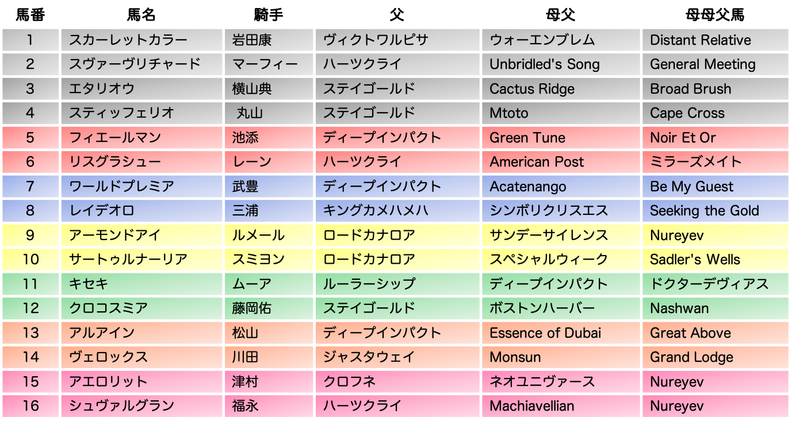
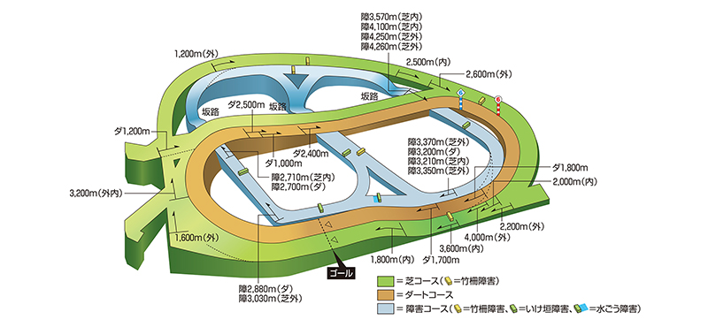

```{r message=FALSE, warning=FALSE, include=FALSE, paged.print=FALSE}
library(tidyverse)
library(rstan)
load("arima.Rdata")
```

<br/>
<br/>

こんにちは、杣取(そまとり)です。みなさん、馬券当たってますか？？

この記事は[Stan Advent Calendar 2019](https://qiita.com/advent-calendar/2019/stan)の21日目の記事として、明日行われる有馬記念の予想をしようという内容です。最近はJRAも広報活動を頑張っているので、競馬をやらない方でも有馬記念をご存じの方は多いのではないでしょうか。なお、私は日にちを間違えていて、うっかり前日予想をすることになってしまいました(ほんとは明日この記事を載せるべきだった・・・)。

私は普段、機械学習を使って競馬を予想して楽しんでいますが、今回はstanのアドカレということでベイズ推定で予想をしてみたいと思います。

さっそく有馬記念の出馬表を見ていきましょう。以下は自作したものなので、ちゃんとしたものが見たい方は[こちら](http://www.jra.go.jp/keiba/thisweek/2019/1222_1/ss.html)をどうぞ。



さて、やはり今回の注目馬は稀代の名馬ともいわれるアーモンドアイの出走ですね。アーモンドアイは新馬戦の2着、大きな不利のあった安田記念の3着を除いて全勝しており、そもそも馬券圏外になったことが1度もない、という素晴らしいおうまさんです。

その一方、アーモンドアイには大きな不安要素があります。それは何といっても有馬記念のコース形態にあります。以下にJRA提供のコース情報を載せました。



御覧の通り、有馬記念が行われる中山競馬場の芝2500mはスタートからいきなりカーブ、しかもすぐにコーナーを回ることになるので先行争いは激しくなりがちです。全体的に勾配もきつく、何度も坂の上り下りがあります。要はとてもトリッキーでタフなコースといえます。

要求されるのは高いパワーとスタミナ。対するアーモンドアイは、スピード能力に関しては他馬と比較して頭1つ2つ抜けていると思いますが、そのパワーとスタミナの方はどうでしょうか。初中山、初2500mということでアーモンドアイにとってもチャレンジングな1戦になることは間違いないでしょう。

実は今回、アーモンドアイ以外の有力馬にとっても中山芝2500というコースへの適性が問われることになるおうまさんは多いです。今回走るおうまさんの中で、中山競馬場の芝2200m以上を走ったことのあるおうまさんは、スヴァーヴリチャード、エタリオウ、スティッフェリオ、フィエールマン、レイデオロ、キセキ、アルアイン、シュヴァルグランの8頭、ちょうど半分ですね。

そうなってくると、必ずしも各場の過去の戦績だけで予想するのはイマイチかもしれません。

そこで今回は、馬の血統に注目してみたいと思います。競馬はブラッドスポーツというぐらい、その血に伝わる競争能力や気性が重要なんですね。なお、血統理論を中心とした競馬予想化には[亀谷敬正](https://yoso.netkeiba.com/?pid=yosoka_profile&id=60)さんや、[栗山求](https://yoso.netkeiba.com/?pid=yosoka_profile&id=78)さんがいます。私も競馬予想の考え方としては、血統と道中位置を重視しますね。

血統予想の良いところは、必ずしもそのコース・距離で走ったことがなくとも、ある程度適性を見極めることができるところにあります。例えば、パワータイプのお父さんから生まれた子は、やはりパワータイプの子になるだろう、とかそんな話ですね。だから、その子がパワーの求められるコースの出走経験がなかったとしても、おそらく得意だろう、とかを考えることができます。

ただでさえ使われることがあまりない中山の芝2500m、特に今回は不安要素のあるおうまさんも多いですから、血統予想がうまくはまるかもしれません。

ごちゃごちゃ書きましたが、さっそくモデルの話をして聞きます。とてもシンプルです。

血統情報の使い方については、亀谷さんの血統理論に従って、4Lで見ていきます。すなわち、父、父母父、母父、母母父の4頭です。何を言っているんだ、という感じなので、以下にまとめますが、要するに3代上までのお父さんについてみていこう、という理論になります。

* 父: その馬のお父さん
* 父母父: その馬のお父さんのお母さんのお父さん
* 母父: その馬のお母さんのお父さん
* 母母父: その馬のお母さんのお母さんのお父さん

ただ、父馬が決まれば当然ながら、父母父馬も同じになりますので、モデルの都合上、父、母父、母母父の3頭について考えることにします。

これらの情報を使って、馬$_{i}$が3着以内に入る確率$\theta_{i}$を次のように考えます。

$theta_{i}$ = $p^{F}_{j}*r_{1}$ + $p^{MF}_{k}*r_{2}$ + $p^{MMF}_{l}*r_{3}$

ここで、$p^{F}_{j}$は父馬$_{j}$の産駒が3着以内に入る確率を表しています。同じように、$p^{MF}_{k}$は母父馬*k*が、$p^{MMF}_{l}$は母父馬$_{l}$がという感じです。

*r*は父馬、母父馬、母母父馬が馬iの3着内率に与える影響力を表しています。したがって、$\Sigma_{m=0}^3 r_{m} = 1$です。

それぞれの*p*には階層パラメータが付いていますが、これはあとで役に立ちます。

あとは単純にこの$\theta_{i}$をパラメータとするベルヌーイ分布から3着以内に入ったかどうかのデータを生成するモデルを立て、ベイズ推定を行います。stan
コードは以下になります。

```{stan fig.align='center', output.var="kosaki"}
data {
  int dataNum;
  
  int fNum;
  int mfNum;
  int mmfNum;

  int f [dataNum];
  int mf [dataNum];
  int mmf [dataNum];
  int juni [dataNum];
}

parameters {
  vector <lower = 0, upper = 1> [fNum] pF;
  vector <lower = 0, upper = 1> [mfNum] pMf;
  vector <lower = 0, upper = 1> [mmfNum] pMmf;
  
  real <lower = 0, upper = 1> muF;
  real <lower = 0, upper = 1> muMf;
  real <lower = 0, upper = 1> muMmf;
  real <lower = 0> sigma;
  
  simplex [3] r;
}

transformed parameters {
  vector <lower = 0, upper = 1> [dataNum] theta;
  
  for(i in 1:dataNum){
    theta[i] = pF[f[i]]*r[1] + pMf[mf[i]]*r[2] + pMmf[mmf[i]]*r[3];
  }
}

model {
  pF ~ normal(muF, sigma);
  pMf ~ normal(muMf, sigma);
  pMmf ~ normal(muMmf, sigma);
  
  juni ~ bernoulli(theta);
}
```

今回の分析では1999年以降の中山競馬場の芝2200m以上のコースで行われた競走を対象に推定を行います。だいたい、521レース、延べ7000頭ほどでした。正直、これはかなり少ないです。やはり、中山のこのぐらいの距離はあまり使われないコースなんですね。なお、血統データは[netkeiba](https://db.netkeiba.com/?rf=navi)からスクレイピングしています。

さて、早速結果を見ていきましょう。以下は、各馬の$\theta_{i}$の事後予測分布です。なお、今回出走するおうまさんのうち、リスグラシューの母父American Post、母母父ミラーズメイト、アーモンドアイとサートゥルナーリアの父ロードカナロアはそれぞれの産駒において中山芝22000m以上の出走経験がありませんでした。なので、これらの馬に関しては階層パラメータからの乱数を使っています。

```{r echo=FALSE, fig.align='center', fig.height=7, fig.width=10}
pred %>%
  mutate(umaName = recode(umaName,
                          "スカーレットカラー" = "Scarlet Color",
                          "スワ―ヴリチャード" = "Suave Richard",
                          "エタリオウ" = "Etario",
                          "スティッフェリオ" = "Stiffelio",
                          "フィエールマン" = "Fierement",
                          "リスグラシュー" = "Lys Gracieux",
                          "ワールドプレミア" = "World Premiere",
                          "レイデオロ" = "Rey de Oro",
                          "アーモンドアイ" = "Almond Eye",
                          "サートゥルナーリア" = "Saturnalia",
                          "キセキ" = "Kiseki",
                          "クロコスミア" = "Crocosmia",
                          "アルアイン" = "Al Ain",
                          "ヴェロックス" = "Velox",
                          "アエロリット" = "Aerolithe",
                          "シュヴァルグラン" = "Cheval Grand") %>%
           as.factor() %>%
           fct_relevel(c("Scarlet Color",
                         "Suave Richard",
                         "Etario",
                         "Stiffelio",
                         "Fierement",
                         "Lys Gracieux",
                         "World Premiere",
                         "Rey de Oro",
                         "Almond Eye",
                         "Saturnalia",
                         "Kiseki",
                         "Crocosmia",
                         "Al Ain",
                         "Velox",
                         "Aerolithe",
                         "Cheval Grand"))) %>%
  ggplot() +
  geom_density(aes(x = prob), fill = "gray", colour = "dimgray") +
  xlab("theta") + ylab("確率密度") +
  facet_wrap(~umaName)
```

なお、いろいろ頑張ったのですが、この結果は収束していません！もう時間なのでこれでいきます！！

一応、推定結果はあんまり変わらないことは確認していますが、その点だけご注意ください。

結果を見ると全体的に被っていて、かつ事後予測分布は広めですね。これは収束していないことのほかに、データがとても少ないことが挙げられると思います。ぱっと見、エタリオウ、スティッフェリオあたりが良い感じです。

これだとわかりにくいので、事後予測平均、95%予測区間を表にしてみます。

```{r echo=FALSE}
pred %>%
  group_by(umaName) %>%
  summarize(mean = mean(prob),
            lower = quantile(prob, 0.025),
            upper = quantile(prob, 0.975)) %>%
  mutate(umaban = rep(1:16)) %>%
  select(umaban, umaName, mean, lower, upper) %>%
  rename("馬番" = umaban,
         "馬名" = umaName,
         "事後平均" = mean,
         "2.5%" = lower,
         "97.5%" = upper)
```

3着以内確率が0.3を超えるおうまさんがちょうど3頭いますね。

エタリオウ、スティッフェリオ、クロコスミアです！！！

絶妙！！！そして値がほぼ同じ！！

ということで本記事の推奨馬券はエタリオウ、スティフェリオ、クロコスミアの3連複、ずばり3-4-12でいきたいと思います！！

現時点での配当は4225.3倍です！！万馬券！！

参考にするかどうかは自己責任でお願いします！

<br/>

それでは、みなさまの馬券に幸あれ！

Enjoy !!!