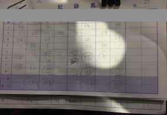
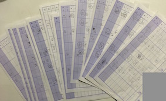

```{r message=FALSE, warning=FALSE, include=FALSE, paged.print=FALSE}
library(pander)
library(tidyverse)
library(gtools)
load("majongBayesAC.Rdata")
```

## 麻雀とは

みなさんは麻雀という競技をやったことがありますでしょうか。
麻雀というのは4人で卓を囲み、牌を引いてきたりいろいろして、なんかの役を上がったりなんだったりして、点数のやりとりをする競技です。

詳しいことは「麻雀　ルール」とかで検索してください。

今回の記事では、麻雀のデータを使ってモデリングしてみたいと思います。

では、「麻雀のデータ」ってなんでしょう？

私は麻雀が大好きなので、よく仲間内で麻雀を打ちます。
その際、半荘(麻雀における1ゲームの単位)ごとに結果を記録しています。
麻雀をする際にはおおよそ4半荘なり、8半荘して、その日の各半荘の得点を合計し、勝者を決めていると思います。
雀荘には記録用紙があるので、下の図のような感じになります。
例えば、下図の場合ですと左から2番目のプレイヤーが勝っています。

<br />
<div style="text-align: center;">

</div>

<br />

多くの場合、負けた人が勝った人にご飯を奢ったり、まあいろいろあるのかもしれません。
いずれにしても、その日の勝者を決めてそれで終わり、という感じが多いと思います。

私の場合は、それを記録として残し続けています。下の図のような感じです。

<div style="text-align: center;">

</div>


<br />

なぜこんなことをやっているのかというと、麻雀は運の要素が非常に強い競技だからです。

ただ、もちろん運の要素が強いことは間違い無いのですが、技術が反映される余地も大いにあり、たくさんの半荘をこなせば、技術による差は明確に出てきます。

というわけで、毎回の結果を記録として残し、本当は誰が強いのかを明らかにしよう、という発想でやっています。

## データから最強の雀士を探す

では、どういうデータがどれくらい溜まっているのか見ていきましょう。

まずは、平均順位などの基本的な情報です。

```{r echo=FALSE, message=FALSE, warning=FALSE, paged.print=FALSE,fig.align='center'}
pander(table,justify="right")
```

全部で135半荘、対局日数でいうと21回分のデータが溜まっています。

勝利数というのはその日のトータルトップを取った回数です。
Player K氏とPlayer S氏が首位タイとなっていますね。

麻雀は1位から4位までを取るので、平均順位は小さい方が強いです。
一方、得点(ポイント)は高い方が良いので、平均得点は高い方が強いと言えます。

勝率は1位を取った半荘の割合、連対率は1位または2位を取った半荘の割合です。

データを見る限り、トータルトップの回数ではなんとも言い難いですが、平均順位などのデータから、Player K氏の方が安定して勝っている印象がありますね。

また、トータルトップの回数こそ少ないものの、Player I氏はPlayer S氏よりも安定した成績を残しています。今後に期待できるかもしれません。

もちろん、最終的にはトップを取ることが大切ですので、Player S氏の存在も無視できません。

<br />

<div style="text-align: center;">
**要するに、これだけだと何とも言えません。**
</div>

<br />

また、各対局日の着順を時系列上にプロットすると、なかなか面白い特徴があります。

```{r echo=FALSE, message=FALSE, warning=FALSE, paged.print=FALSE,fig.align='center'}
rank %>%
  rename("Player I" = "izumi", "Player K" = "kento",
         "Player U" = "sakamoto", "Player S" = "somatori") %>%
  mutate(day = rep(1:nrow(rank))) %>%
  gather(key = player, value = rank, -day) %>%
  ggplot() + 
  geom_line(aes(x = day, y = rank, colour = player)) +
  theme_set(theme_gray(base_size = 10,base_family="HiraKakuProN-W3")) +
  theme(axis.title.x = element_text(colour = "black",
                                    family = "HiraKakuProN-W3"),
        axis.title.y = element_text(colour = "black",
                                    family = "HiraKakuProN-W3"),
        axis.text.x = element_text(colour = "black"),
        axis.text.y = element_text(colour = "black"),
        axis.line = element_line(colour = "black"), 
        axis.ticks = element_blank(),
        legend.title = element_text(colour = "black",
                                    family = "HiraKakuProN-W3")) +
  xlab("対局日数") + ylab("着順") + labs(colour = "雀士") + ylim(4,1) +
  scale_colour_manual(values=c("darkred","skyblue1","orchid1","midnightblue")) 
  
```

<br />

初めの頃はPlayer K氏の連勝が目立ちますね。ところが、後半になってくるとPlayer S氏もそれなりに勝つようになってきますし、なによりPlayer I氏の成績が全体的に良くなってきている気がします。

もちろん、みなさん麻雀の上達に向けていろいろ努力をしていると思いますので、技術の向上によっていろいろな変化があるんだと思います。
もしかすると、麻雀データは時系列データとして見るのが良いのかもしれませんね。

## stanでモデリングしよう

これまでのデータだと、対局日によって勝者はだいぶ違いますし、どのデータを軸に見るのかによって誰が強そうかも変わってきます。

というのも、誰が強いのかを判断するのに、データがまだまだ十分ではありません。
私が尊敬してやまない女流プロ雀士の[魚谷侑未プロ](https://ja.wikipedia.org/wiki/%E9%AD%9A%E8%B0%B7%E4%BE%91%E6%9C%AA)は著書である[ゆーみんの現代麻雀が最速で強くなる本](https://www.amazon.co.jp/dp/B01GCS7600/ref=dp-kindle-redirect?_encoding=UTF8&btkr=1)で、麻雀の実力について議論するには1000半荘ぐらい必要だと述べています。麻雀はそれぐらい運の要素の強いゲームであるということですね。

ところが、1000半荘やる、というのは並大抵のことではありません。飛び終了なし(誰かの持ち点が0点を下回ったとして半荘を続行するルール)の場合は、おおよそ、1半荘に1時間程度かかると思います。

計算を簡単にするために1半荘1時間で計算していたとしても、1000時間かかります。1日8半荘、8時間やったとしても125日。週に1回集まったとしても125週間、おおよそ2年半かかる計算になります。

もちろん、半荘が長引くこともあるでしょうし、そもそも毎週やる、という計算に無理があります。というわけで、おそらく4年ぐらいかかるんじゃないでしょうか。だれが麻雀強いのかを決めるのに4年、膨大な日数ですね。

<br />

そこでベイズ推定が役に立ちます。

各半荘の結果や、各対局日の勝ち負けは背後にある雀力という潜在的なパラメータに規定されていると考えます。
ところが、麻雀には運の要素も大きいので、雀力の相対的な差だけではなく、運という不確実性も絡んでデータは生成されています。

ここで、麻雀の成績であるポイントを生成するのに最適な確率分布を紹介したいと思います。

<br />

<div style="text-align: center;">
**ディリクレ分布です。**
</div>

<br />


そのことを理解するために、簡単に麻雀の成績について解説したいと思います。
各半荘において最終的に得られる成績は、ポイントになります。
各プレイヤーは25000点を持って半荘をスタートし、その後のなんやかんやのやりとりをして点数を増やしたり減らしたりします。
そして、最終的にはポイントという形で、理論上はマイナス無限大からプラス無限大までのいずれかの値になります。
無限とかいうと大げさですが、おおよそ-50から+50くらいになります。

ポイントの重要な特徴としては、4人のポイントを足し合わせると、必ず0になるということです。

データ生成分布を考える際に重要なのは、各半荘のデータは毎回足すと同じ値になるように相対的なものとして表現される、ということです。

指数変換を施すことで、相対性を維持したまま足したら1になるように変換することはできますので、麻雀データはディリクレ分布で生成するのに最適なデータと言えます。

なお、ディリクレ分布については[こちら](http://y-mattu.hatenablog.com/entry/2016/03/03/143451)や[こちら](https://www.slideshare.net/stjunya/ss-29629644)を参考にしてください。

各プレイヤーの雀力をabilityというパラメータで表した場合、各半荘のデータは次のように表現できます。

<div style="text-align: center;">
$pointPerHantyan$<sub>t</sub> 〜 $dirichlet(\vec{ability})$
</div>

なお、$pointPerHantyan$は$t$番目の半荘のポイントです。

同じように、各対局日の結果も、各プレイヤーの雀力に基づいて生成されると考えます。

<div style="text-align: center;">
$PointPerDay$<sub>d</sub> 〜 $dirichlet(\vec{Ability})$
</div>

ディリクレ分布からデータが生成されているので、各プレイヤーの雀力における相対的な差から、データが発生する過程には不確実性が考慮されています。これは麻雀における運の要素といえるでしょう。

シンプルなモデルであればこれで完成です。
ただ、先ほどのグラフで、麻雀の成績には時系列的な変化がありそうな気配があります。おそらく、たゆまぬ努力によって強くなったプレイヤーもいるのでしょう。

ということで、雀力は時系列的に変化していると考えます。
その際、ある日に発揮される雀力は直近の対局日に発揮される雀力に近いだろう、という状態空間モデル的な仮定を置きます。
数式にすると次のような形になります。

<div style="text-align: center;">
$ability$<sub>sd</sub> 〜 $normal(2 * ability$<sub>sd-2</sub> - $ability$<sub>sd-1</sub>$, 1)$
</div>

$ability$<sub>sd</sub>はs番目のプレイヤーにおいてd番目の対局日に発揮される雀力です。

## モデルコード

これまで述べてきたモデルをstanコードにすると、次のようになります。

```{stan fig.align='center', output.var="kosaki"}
data {
  int player; // プレイヤー数
  int hantyanNum; // 半荘数
  int day; // 対局日数
  int hantyanDay[hantyanNum]; // 各半荘と対局日数を紐づけるやつ
  simplex [player] point [hantyanNum]; // 各半荘のポイント
  simplex [player] pointPerDay [day]; // 各対局日のポイント
}

parameters {
  vector <lower = 0> [player] ability [day]; // 雀力
  }
model {
  ability[1] ~ cauchy(0, 25); // 雀力1日目
  ability[2] ~ cauchy(0, 25); // 雀力2日目
  
  for(d in 4:day){
    ability[d] ~ normal(2*ability[d-1]-ability[d-2],1); // 雀力の遷移
    }
    
  for(t in 1:hantyanNum){
    point[t,] ~ dirichlet(ability[hantyanDay[t]]); // 各半荘におけるポイントのデータ生成
    }
    
  for(d in 1:day){
    pointPerDay[d,] ~ dirichlet(ability[d]); // 各対局日におけるポイントのデータ生成
    }
}
```

## 雀力の事後分布(時系列Ver)

上記のstanコードで推定すると、各対局日ごとに雀力の事後分布が得られます。
それぞれについて事後平均を算出し、各プレイヤーの雀力の推移を見てみます。

```{r echo=FALSE, fig.align='center', message=FALSE, warning=FALSE, paged.print=FALSE}
abilityTrateSpace %>%
  ggplot() +
  geom_line(aes(x = hantyan,y = value,colour = key), size = 1) + 
  theme_set(theme_gray(base_size = 10,base_family = "HiraKakuProN-W3")) +
  xlab("日にち") + ylab("雀力") +
  scale_colour_manual(values = c("darkred", "skyblue1", "orchid1", "midnightblue")) +
  labs(colour = "雀士") +
  theme(axis.title.x = element_text(colour = "black"),
        axis.title.y = element_text(colour = "black"),
        axis.text.x = element_text(colour = "black"),
        axis.text.y = element_text(colour = "black"),
        axis.line = element_line(colour = "black"), 
        axis.ticks = element_blank())
```

うーん・・・
なんかイマイチな感じですね。

状態の遷移を仮定していない1日目、2日目からの急降下といい、うまく推定できていない感もあります。
ただ、これは事前分布やらなんやらを変えても概ね同じです。

おそらくもっとも大きな問題は、各対局日で雀力が異なるという仮定を置いていることです。
当然、その日の勝者の雀力が最も高く推定されると思います。
このことは、上の方で出した各対局日の着順のプロットと概ね同じ形をしていることからも言えるかもしれません。
各対局日における半荘数は5-8半荘なので、データ数がが非常に少ないというのもあるかもしれません。

## シンプルだが現実に即したモデル

というわけで、もっともシンプルなモデルを考えてみます。
全135半荘の背後にはプレイヤーごとに単一の雀力というパラメータが控えており、各半荘の結果や各対局日の結果は運によってバラついているとするモデルです。

数式は、先ほどのモデルの時系列的変化の部分をとっぱらったものになるので割愛します。

麻雀の強さを考える上で135半荘は十分とは言えないまでもそこそこの数になりますので、このモデルはとても現実をよく反映しています。

当初は、時系列的変化の部分を工夫しようとか、運の良さもパラメータにしようとかいろいろ考えていました。しかし、たったの数半荘で麻雀の強さを考えようというのに無理があるのかもしれません。
また、運をパラメータにしてしまうと、ディリクレ分布から生成される際の不確実性をなんと解釈したらよいかわからなくなります。

案外、シンプルなモデルの方が現実をよく反映するのかもしれませんね。

## モデルコード

先ほどのモデルが少しシンプルになっただけですが、改めてモデルコードを貼って置きます。

```{stan fig.align='center', output.var="kosaki"}
data {
  int player;
  int hantyanNum;
  int day;
  int hantyanDay[hantyanNum]  ;
  simplex [player] point [hantyanNum];
  simplex [player] pointPerDay [day];
}

parameters {
  vector <lower = 0> [player] ability;
  }
model {
  ability ~ normal(0, 1000);
    
  for(t in 1:hantyanNum){
    point[t,] ~ dirichlet(ability);
    }
    
  for(d in 1:day){
    pointPerDay[d,] ~ dirichlet(ability);
    }
}
```

## 雀力の事後分布(単一パラメータVer)

今回のモデルでは各プレイヤーの雀力が推定されています。各々の雀力を比較するために、事後分布を重ねてプロットしてみます。

```{r echo=FALSE, fig.align='center', message=FALSE, warning=FALSE, paged.print=FALSE}
abilityDirichlet %>%
  as.data.frame() %>%
  gather() %>%
  ggplot() +
  geom_histogram(aes(x = value,y = ..density..,
                     fill = key),
                 alpha = 0.7,
                 position = "identity") +
  theme_set(theme_gray(base_size = 10,base_family = "HiraKakuProN-W3")) +
  xlab("雀力") + ylab("確率密度") + labs(fill = "雀士") +
  scale_fill_manual(values = c("darkred", "skyblue1", "orchid1", "midnightblue")) +
  theme(axis.title.x = element_text(colour = "black"),
        axis.title.y = element_text(colour = "black"),
        axis.text.x = element_text(colour = "black"),
        axis.text.y = element_text(colour = "black"),
        axis.line = element_line(colour = "black"), 
        axis.ticks = element_blank())
```

<br />
なんだか良さげですね。Player K氏とPlayer U氏の間には明確な実力差がありそうです。
重ねたプロットだけではわかりづらい部分もあると思うので、一応サマリーを出して置きます。
ability[1]~ability[4]は、それぞれI氏、K氏、U氏、S氏に対応します。

<br />

```{r echo=FALSE, message=FALSE, warning=FALSE, paged.print=TRUE}
samplesDirichlet
```

<br />

これらの結果を見た感じ、**最強の雀士はPlayer K氏**と言えそうです。
そして、Player S氏はPlayer I氏に勝利数でこそ上回っていますが、そのほかの成績の安定性から、Player I氏の方が若干強めに推定されています。

ここについては、現実の麻雀をとてもよく反映していて、いかに4着を回避するか、1位を取れない時にいかに2位に留まるか、ということの重要性を表しています。


ただ、この辺りの3名は事後分布もだいぶ重なっているので、今後の勝負に期待ですね。Player K氏は暫定首位の座を守りきれるのでしょうか！？

Player U氏も95%信用区間ではPlayer I氏、Player S氏に被っているので、今後の成長に期待できます。

## 今回のデータにどれほど適合するか？

ところで今回の推定値、なんだかとても小さな値になっていますね。
これも事前分布をいろいろ変えてもあまり変わりがありません。
それに、プレイヤー間の雀力の差もとても小さいです。

果たしてこんなもんなのか、というのは当然の疑問かと思います。
私はディリクレ分布にあまり詳しくないので、この辺りはなんとも言えません。
ひとまず、今回得られた推定値から今回と同様に135半荘のデータを生成して、どのぐらい似ているかを見てみたいと思います。

手順としては、次のようにやってみます。

1. 得られた事後分布から各プレイヤーの雀力(雀力ベクトル)を135半荘分もってくる
2. 雀力ベクトルをパラメータとしたディリクレ分布から135半荘分のデータを生成する
3. 各半荘のデータについて値の大小関係から着順に変換する
4. 勝率、連対率を計算する
5. 1~4を1000回繰り返す

という流れでいきたいと思います。
1~4で生成されるデータはもし同じような135半荘分のデータがあったら、という事後分布からの予測になるとおもいます。
今回はその予測を1000回行い、予測区間を算出します。
実際のデータが予測区間に入っているかどうかを元にモデルの良さを評価したいと思います。

<br />

```{r echo=FALSE, message=FALSE, warning=FALSE, paged.print=FALSE}
winRatePred %>%
  rename(player = key) %>%
  rename(win = value) %>%
  mutate(rentai = rentaiRatePred$value) %>%
  gather(key = group, value = value, win, rentai) %>%
  rename(ratioPred = value) %>%
  mutate(rowData = c(rep(winRentai$value[1],num),
                     rep(winRentai$value[3],num),
                     rep(winRentai$value[5],num),
                     rep(winRentai$value[7],num),
                     rep(winRentai$value[2],num),
                     rep(winRentai$value[4],num),
                     rep(winRentai$value[6],num),
                     rep(winRentai$value[8],num))) %>%
  transform(group = factor(group,levels = c("win", "rentai"))) %>%
  ggplot() +
  geom_violin(aes(x = group, y = ratioPred,fill = group),
               colour = "black",alpha = 0.5) +
  geom_point(aes(x = group, y = rowData,
                 fill = group)) +
  theme_set(theme_gray(base_size = 10,base_family="HiraKakuProN-W3")) +
  xlab("勝率と連対率") + ylab("勝率/連対率") + labs(fill = "雀士") +
  scale_fill_manual(values=c("orchid1","deepskyblue")) +
  theme(axis.title.x = element_text(colour = "black"),
        axis.title.y = element_text(colour = "black"),
        axis.text.x = element_text(colour = "black"),
        axis.text.y = element_text(colour = "black"),
        axis.line = element_line(colour = "black"), 
        axis.ticks = element_blank()) + 
  facet_wrap(~player)
```

<br />

まあまあいい感じなのではないでしょうか。
このモデルでは、概ねいい感じに各プレイヤーの雀力を運によるばらつきを考慮しつつ推定することができていると思います。

Player S氏とPlayer U氏についてはだいぶギリギリですが・・・
Player S氏は実際より弱く、Player U氏は実際より強く推定されているのかもしれません。このあたりはさらなるモデルの改良が望まれるところです。

麻雀のモデルについては定期的に試行錯誤をしているのですが、結果的にだいぶシンプルなモデルに落ち着きました。
もし、こんなモデルもいいんじゃないか、というものがあれば、是非教えてください。

<br />

それでは、**Enjoy Ma-jong !!**

<br />
<p>Copyright &copy; 2017 Keita Somatori. All rights reserved </p>